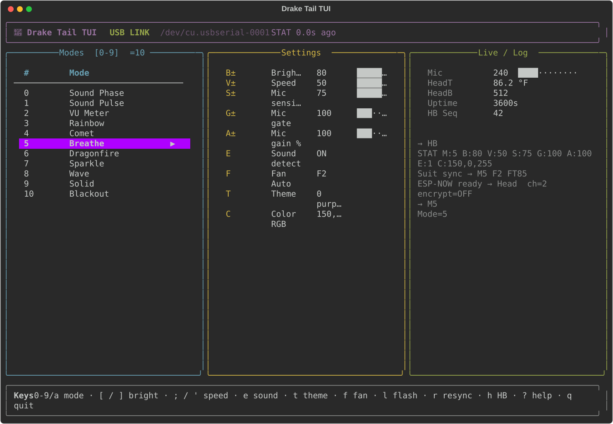

# DRAKE_2_0_TAIL

ESP32 (Node32S) firmware for the **dragonsuit tail** — system hub.

## Role
- Analog mic (`A0`) — **electret + AGC preamp**, ~1.25 V bias, 0–3.3 V + envelope path
- **BLE** remote control (NimBLE NUS)
- **ESP-NOW** ↔ Head (mic excess ~200 Hz, commands, phase sync, sensors)
- **ASK TX** (pin 17) → PAWB: mode/cmd always; **mic pulse only on M0–M2**
- WiFi STA to Head SoftAP (`TMDRAKE` ch2)
- 12× NeoPixels (GPIO 22)
- **USB serial** same command language as BLE (for tools / TUI)

### Mic scale (M0 Sound Phase / M1 Sound Pulse / M2 VU)
**AGC mic** → noise-floor track → **excess** → `micNorm01()`.  
Gate **G** wakes M0/M1; VU always paints from excess.

**Hardware RC LPF (recalled):** **~10 kΩ + ~0.1 µF** → **fc ≈ 159 Hz**. [MIC_HARDWARE.md](MIC_HARDWARE.md).

**Future:** FFT / **16-band spectrum**, BLE snapshot, band-select fire — [SPECTRUM_FUTURE.md](SPECTRUM_FUTURE.md) (not implemented).

## Tail settings TUI (Mac / Linux)



USB serial dashboard for modes, brightness, mic, fan, themes, live STAT.

```bash
cd DRAKE_2_0_TAIL
pip3 install -r tools/requirements.txt
python3 tools/tail_tui.py
# or: python3 tools/tail_tui.py -p /dev/cu.usbserial-0001
```

Full keys & notes: **[tools/README.md](tools/README.md)**

## Docs
| Doc | Contents |
|-----|----------|
| **[SYSTEM.md](SYSTEM.md)** | Full architecture |
| **[MIC_HARDWARE.md](MIC_HARDWARE.md)** | **AGC mic** + RC LPF (**~10k + 0.1 µF**) |
| **[SPECTRUM_FUTURE.md](SPECTRUM_FUTURE.md)** | Future FFT / 16-band / band-select fire |
| **[ESPNOW.md](ESPNOW.md)** | ESP-NOW MACs, packets, gotchas |
| **[APP_INTERFACE.md](APP_INTERFACE.md)** | Phone app contract |
| **[APP_TEAM.md](APP_TEAM.md)** | App requirements (HB, link service) |
| **[REPO.md](REPO.md)** | Git contents + agent upload limits |
| **[IMPROVEMENTS.md](IMPROVEMENTS.md)** | Roadmap |
| **[tools/README.md](tools/README.md)** | Tail TUI |

## Repo contents

Mostly `.ino` + markdown. Libraries/assets for build/docs allowed — **[REPO.md](REPO.md)**.

## ESP-NOW quick start
1. Flash Tail + Head, read MACs from Serial.  
2. Set `HEAD_PEER_MAC` in `EspNowCom.ino`.  
3. Set `TAIL_PEER_MAC` on Head.  
4. Keys: `TMDrakePMK_2026!` / `TMDrakeLMK_2026!`  
5. Reflash both.

http://tmdrake.com
